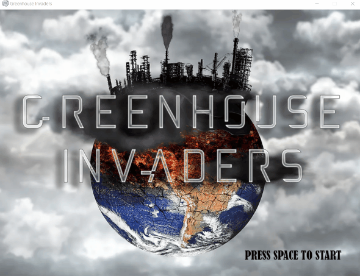

# Greenhouse Invaders
OSU Hackathon

This is the beginning products of OSU Hackathon with the theme being climate/energy for Fall of 2021. 

<!--  -->



## Requirements
Pygame requires Python; if you don't already have it, you can download it from [python.org](https://www.python.org/). 
## Setup
Windows:

```sh
 > pip install pygame
```

# Usage
```sh
 > python .\main.py
```
